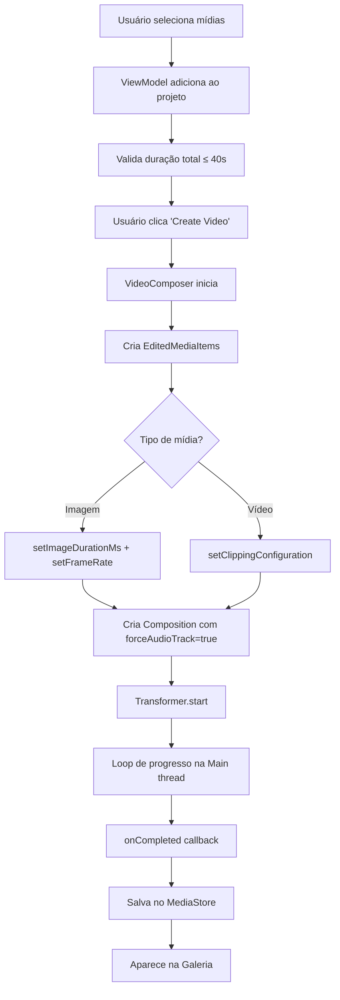

# Guia de Composição de Vídeos com Media3 Transformer

Este documento explica como implementar a funcionalidade de criar vídeos a partir de imagens e vídeos usando o Jetpack Media3 Transformer.

## Visão Geral

A solução permite que usuários selecionem múltiplas imagens e/ou vídeos curtos e os combine em um único vídeo de até 40 segundos, que é automaticamente salvo na galeria do dispositivo.

## Tecnologias Utilizadas

- **Jetpack Media3 Transformer 1.5.0**: API oficial do Android para transformação e composição de mídia
- **Jetpack Compose**: UI moderna e reativa
- **Kotlin Coroutines & Flow**: Para operações assíncronas
- **MediaStore API**: Para salvar vídeos na galeria pública

## Arquitetura da Solução

### 1. Modelo de Dados (`MediaItem.kt`)

Define os tipos de mídia suportados:

```kotlin
sealed class MediaItem {
    abstract val uri: Uri
    abstract val id: String

    data class Image(
        override val uri: Uri,
        override val id: String = uri.toString(),
        val durationMs: Long = 3000 // 3 segundos por padrão
    ) : MediaItem()

    data class Video(
        override val uri: Uri,
        override val id: String = uri.toString(),
        val durationMs: Long
    ) : MediaItem()
}
```

**Projeto** gerencia a lista de itens e validação de duração:

```kotlin
data class MediaProject(
    val items: List<MediaItem> = emptyList(),
    val maxDurationMs: Long = 40_000 // 40 segundos máximo
)
```

### 2. Compositor de Vídeo (`VideoComposer.kt`)

#### Dependências Necessárias

```kotlin
implementation("androidx.media3:media3-transformer:1.5.0")
implementation("androidx.media3:media3-effect:1.5.0")
implementation("androidx.media3:media3-common:1.5.0")
implementation("androidx.media3:media3-exoplayer:1.5.0")
implementation("androidx.media3:media3-muxer:1.5.0")
```

#### Configuração Crítica para Imagens

**REQUISITO OBRIGATÓRIO**: Imagens precisam de configuração especial no Media3:

```kotlin
// Para IMAGENS
val mediaItem = MediaItem.Builder()
    .setUri(uri)
    .setImageDurationMs(durationMs)  // Define duração da imagem
    .build()

EditedMediaItem.Builder(mediaItem)
    .setFrameRate(30)  // OBRIGATÓRIO! Sem isso ocorre IllegalStateException
    .setRemoveAudio(true)
    .build()
```

**Por que `setFrameRate(30)` é obrigatório?**

O `ImageAssetLoader` do Media3 valida internamente se o frame rate foi definido. Sem isso, a assertion na linha 115 do ImageAssetLoader falha com `IllegalStateException`. Isso está documentado no código oficial do Media3 demo.

#### Configuração para Vídeos

```kotlin
// Para VÍDEOS
val mediaItem = MediaItem.Builder()
    .setUri(uri)
    .setClippingConfiguration(
        MediaItem.ClippingConfiguration.Builder()
            .setStartPositionMs(0)
            .setEndPositionMs(durationMs)  // Limita duração
            .build()
    )
    .build()

EditedMediaItem.Builder(mediaItem)
    .build()  // Não precisa de setFrameRate
```

#### Composição: Misturando Imagens e Vídeos

**PROBLEMA**: Quando você mistura imagens (sem áudio) com vídeos (com áudio), o Media3 lança exceção:

```
IllegalStateException: The preceding MediaItem does not contain any track of type 1.
If the Composition contains a sequence that starts with items without audio tracks (like images),
followed by items with audio tracks, Composition.Builder.experimentalSetForceAudioTrack() needs to be set to true.
```

**SOLUÇÃO**:

```kotlin
val composition = Composition.Builder(listOf(sequence))
    .setTransmuxVideo(false)  // Força recodificação de vídeo
    .setTransmuxAudio(false)  // Força recodificação de áudio
    .experimentalSetForceAudioTrack(true)  // CRÍTICO para imagens + vídeos
    .build()
```

### 3. Threading e Progresso

**IMPORTANTE**: O Transformer DEVE ser acessado apenas na thread principal (Main thread).

```kotlin
// ERRADO - Causa IllegalStateException
withContext(Dispatchers.IO) {
    transformer.getProgress(progressHolder)  // ❌ Thread errada!
}

// CORRETO
val progressHolder = ProgressHolder()
while (!completed && !errorOccurred) {
    val state = transformer.getProgress(progressHolder)  // ✅ Main thread
    when (state) {
        Transformer.PROGRESS_STATE_AVAILABLE -> {
            val progress = (progressHolder.progress * 100).toInt()
            emit(CompositionState.Progress(progress))
        }
    }
    delay(100)
}
```

### 4. Salvando na Galeria

Para Android 10+ (API 29+), use MediaStore com `RELATIVE_PATH`:

```kotlin
private fun saveToGallery(videoFile: File): Uri? {
    val contentValues = ContentValues().apply {
        put(MediaStore.Video.Media.DISPLAY_NAME, fileName)
        put(MediaStore.Video.Media.MIME_TYPE, "video/mp4")

        if (Build.VERSION.SDK_INT >= Build.VERSION_CODES.Q) {
            // Android 10+: Salva em Movies/Reels
            put(MediaStore.Video.Media.RELATIVE_PATH,
                Environment.DIRECTORY_MOVIES + "/Reels")
            put(MediaStore.Video.Media.IS_PENDING, 1)  // Oculta até finalizar
        }
    }

    val uri = resolver.insert(MediaStore.Video.Media.EXTERNAL_CONTENT_URI, contentValues)

    uri?.let {
        // Copia arquivo para MediaStore
        resolver.openOutputStream(it)?.use { output ->
            videoFile.inputStream().use { input ->
                input.copyTo(output)
            }
        }

        // Marca como completo (aparece na galeria)
        if (Build.VERSION.SDK_INT >= Build.VERSION_CODES.Q) {
            contentValues.clear()
            contentValues.put(MediaStore.Video.Media.IS_PENDING, 0)
            resolver.update(it, contentValues, null, null)
        }
    }

    return uri
}
```

### 5. Permissões Necessárias

```xml
<uses-permission android:name="android.permission.READ_MEDIA_IMAGES" />
<uses-permission android:name="android.permission.READ_MEDIA_VIDEO" />
<uses-permission android:name="android.permission.READ_EXTERNAL_STORAGE"
    android:maxSdkVersion="32" />
<uses-permission android:name="android.permission.WRITE_EXTERNAL_STORAGE"
    android:maxSdkVersion="28" />
```

**Nota**: Android 10+ não precisa de `WRITE_EXTERNAL_STORAGE` ao usar MediaStore.

## Fluxo Completo de Composição



## Problemas Comuns e Soluções

### 1. `IllegalStateException` no ImageAssetLoader

**Erro**:
```
java.lang.IllegalStateException
    at androidx.media3.transformer.ImageAssetLoader.<init>(ImageAssetLoader.java:115)
```

**Causa**: Falta `setFrameRate()` nas imagens.

**Solução**:
```kotlin
EditedMediaItem.Builder(mediaItem)
    .setFrameRate(30)  // Adicione isso!
    .build()
```

### 2. Erro ao misturar imagens com vídeos

**Erro**:
```
IllegalStateException: The preceding MediaItem does not contain any track of type 1
```

**Solução**:
```kotlin
Composition.Builder(listOf(sequence))
    .experimentalSetForceAudioTrack(true)  // Adicione isso!
    .build()
```

### 3. `IllegalStateException: Transformer is accessed on the wrong thread`

**Causa**: Tentando acessar Transformer em thread de background.

**Solução**: Remova `withContext(Dispatchers.IO)` do loop de progresso.

### 4. Vídeo não aparece na galeria

**Causa**: Não usou MediaStore ou não definiu `IS_PENDING = 0`.

**Solução**: Use o código completo de `saveToGallery()` acima.

## Configurações de Qualidade

```kotlin
val transformer = Transformer.Builder(context)
    .setVideoMimeType("video/avc")  // H.264 codec
    // Qualidade automática baseada na resolução das imagens
    .build()
```

O Media3 ajusta automaticamente:
- **Bitrate**: ~10 Mbps para 1080p
- **Resolução**: Mantém proporção das imagens originais
- **Frame Rate**: 30 fps

## Limitações Conhecidas

1. **Duração máxima**: 40 segundos (configurável)
2. **Formatos suportados**:
   - Imagens: JPEG, PNG, WebP
   - Vídeos: MP4, WebM (codecs suportados pelo dispositivo)
3. **Performance**: Vídeos grandes podem levar alguns segundos para processar
4. **API mínima**: Android 7.0 (API 24)

## Referências

- [Media3 Transformer Documentation](https://developer.android.com/jetpack/androidx/releases/media3)
- [Media3 Demo App](https://github.com/androidx/media/tree/release/demos/transformer)
- [Media3 1.5.0 Release Notes](https://android-developers.googleblog.com/2025/01/media3-150-whats-new.html)
- [MediaStore API Guide](https://developer.android.com/training/data-storage/shared/media)

## Conclusão

Esta implementação usa a API oficial do Android (Media3) para composição de vídeos, garantindo:

✅ Compatibilidade com todas as versões do Android 7.0+
✅ Performance otimizada com aceleração de hardware
✅ Salvamento correto na galeria do dispositivo
✅ Suporte para imagens e vídeos misturados
✅ Feedback de progresso em tempo real

A chave para o sucesso foi entender os requisitos específicos do Media3:
1. `setFrameRate()` obrigatório para imagens
2. `experimentalSetForceAudioTrack(true)` para mesclar imagens e vídeos
3. Acesso ao Transformer apenas na Main thread
4. Uso correto do MediaStore para salvar na galeria
